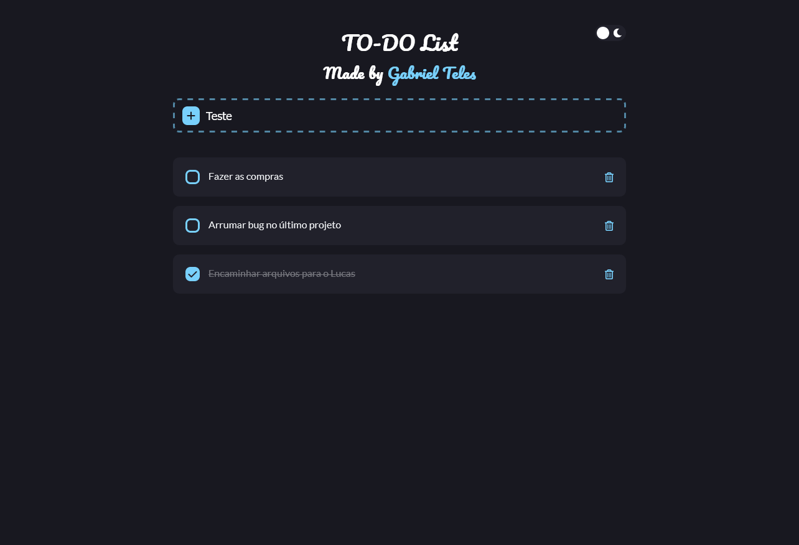

# TO DO LIST.

This is just a personal TO DO List study project.

## Table of contents

- [Overview](#overview)
  - [Screenshot](#screenshot)
  - [Built with](#built-with)
  - [Author](#author)

## Overview

### Pages

Git Pages - [Project](https://gabrielfteles.github.io/TO-DO-List/)

### The challenge

Users should be able to:

- View the optimal layout depending on their device's screen size.
- Create and delete new tasks.
- Change task status if completed.
- Tasks still if page reload.
- Change theme page color (Still working on colors).

### Screenshot



## Built with

Technologies

- HTML
- CSS
- JS

Other

- Semantic HTML5 markup
- CSS custom properties
- Flexbox
- LocalStorage
- JavaScript concepts

```html
<h1>Some HTML code I'm proud of</h1>
```
```css
.proud-of-this-css {
  color: papayawhip;
}
```
```js
const proudOfThisFunc = () => {
  console.log('🎉')
}
```

## Author

- Linkedin - [Gabriel Teles](https://www.linkedin.com/in/gabriel-teles-b28709234/)
- Twitter - [@ToVivendoErrado](https://www.twitter.com/ToVivendoErrado)
